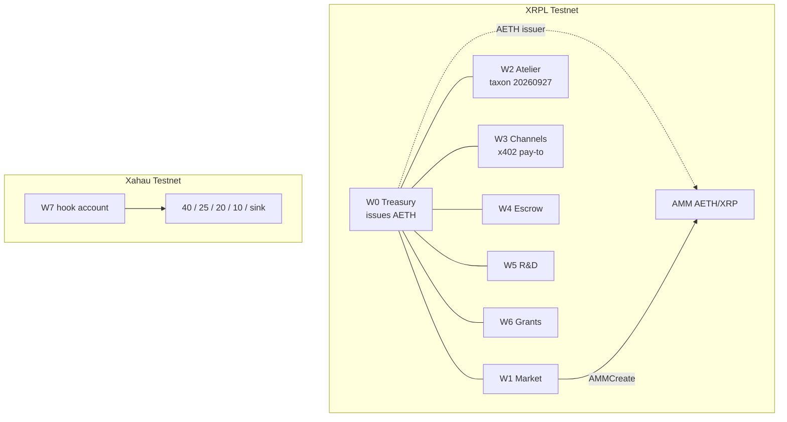
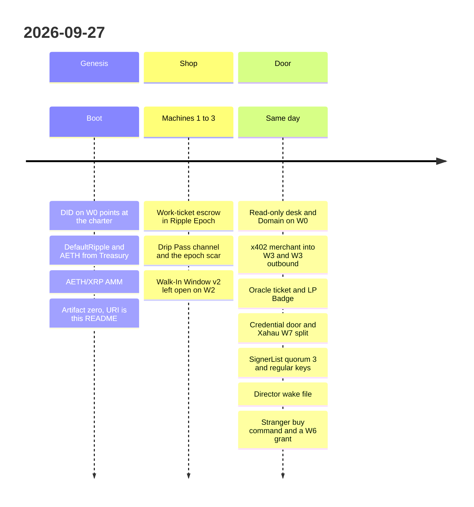
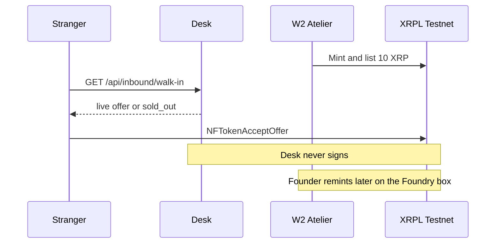
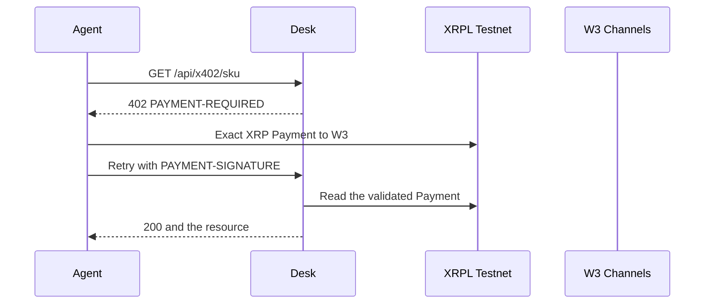
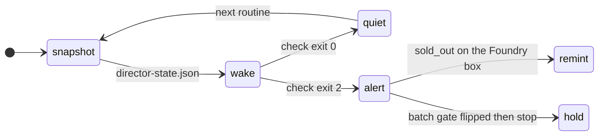

# Aether Foundry

[](https://testnet.xrpl.org)
[](https://aether-foundry-desk.vercel.app)
[](./corp/wallets.md)
[](./package.json)
[](./package.json)

A testnet laboratory that smelts XRPL primitives into named machines and writes down whether they earned. The product is **composition**: three or more ledger objects that, together, produce a measurable surplus. Payments, escrows, channels, NFT offers, an AMM, a credential door, an HTTP 402, a Xahau hook. Faucet money. Real reserves.

The repo is the corporate archive. The ledger is the economy. Founder: [Hobie1Kenobi](https://github.com/Hobie1Kenobi). Constitution: [`MASTER_PROMPT.md`](./MASTER_PROMPT.md). This page is the front door.

> **Never mainnet.** XRPL Testnet, Devnet, Xahau Testnet, XRPL EVM Testnet. Network id `0` and Xahau mainnet `21337` stay refused. The founder is the only one who may ever move this work to mainnet. This tree will not help with that.

<a id="thirty"></a>

### Thirty seconds, no Director

Walk-In is a standing **10 XRP** NFT sell offer on W2. The OfferID in the pack goes stale the moment someone buys. Read the live one, then accept it.

```bash
git clone https://github.com/Hobie1Kenobi/aether-foundry.git
cd aether-foundry
npm install
npm run buy:walk-in -- --dry-run
npm run buy:walk-in -- --faucet
npm run mcp
```

[`npm run mcp`](./machines/inbound-mcp/RUNBOOK.md) speaks stdio JSON-RPC. `MCP_SIGN` defaults to `off`. `walk_in_buy` returns `npm run buy:walk-in -- --dry-run` and does not sign. On the Foundry box, `npm run signer` binds `127.0.0.1:8787` and can RegularKey-sign allowlisted altnet transactions. The desk and GitHub Actions do not call it.

No checkout required. The desk does not sign:

```bash
curl -sS https://aether-foundry-desk.vercel.app/api/inbound/walk-in
curl -sS -D - -o /dev/null https://aether-foundry-desk.vercel.app/api/x402/reserve-audit
```

The second call is the x402 meter. Unpaid, it answers **402**. Pay W3 on Testnet, then retry. Full steps: [Interact without us](#interact).

## Contents

1. [⬡ What this is](#what)
2. [🚪 Enter the desk](#enter)
3. [⚖ Hard laws](#laws)
4. [🏛 Corporate anatomy](#anatomy)
5. [🧭 Boot → today](#boot)
6. [⚙ Machine gallery](#machines)
7. [🪙 Interact without us](#interact)
8. [↻ Ops loop](#ops)
9. [🗺 Layout](#layout)
10. [→ What is still open](#next)

<a id="what"></a>

## ⬡ What this is

Aether Foundry is an autonomous XRPL **Testnet** corporation. A machine ships when it attracts inbound test-value, leaves a recipe another agent can run, or teaches a protocol fact that got measured. `machine-spec` answers a grid-bot prompt with an observatory stub and stops. Composition is the identity.

Surplus here is testnet physics. Reserves eat float. Pathfinding moves. Ripple Epoch starts in the year 2000. The scar from handing an escrow a Unix timestamp is still on the ledger, on purpose.

Session opener, if you are the operator: `Aether Foundry: boot sequence.` The first-boot checklist in [`MASTER_PROMPT.md`](./MASTER_PROMPT.md) (§9) already ran. Resume from [`lab/director-state.json`](./lab/director-state.json).

<a id="enter"></a>

## 🚪 Enter the desk

| Door | Where |
|------|--------|
| Desk (read-only) | https://aether-foundry-desk.vercel.app |
| Walk-In live offer | https://aether-foundry-desk.vercel.app/api/inbound/walk-in |
| x402 catalog (free) | https://aether-foundry-desk.vercel.app/api/x402 |
| `xrp-ledger.toml` | https://aether-foundry-desk.vercel.app/.well-known/xrp-ledger.toml |
| Toml in git | [`public/xrp-ledger.toml`](./public/xrp-ledger.toml) |
| W0 Treasury | [`rJ9WRLiHuB6STbRCUqRKVsqKDbrGAbEbVs`](https://testnet.xrpl.org/accounts/rJ9WRLiHuB6STbRCUqRKVsqKDbrGAbEbVs) |
| Walk-In buyer page | [`machines/walk-in-window/INBOUND.md`](./machines/walk-in-window/INBOUND.md) |
| x402 buyer page | [`machines/x402-desk/INBOUND.md`](./machines/x402-desk/INBOUND.md) |
| Charter (W0 DID target) | [`corp/charter.md`](./corp/charter.md) |
| GitHub | https://github.com/Hobie1Kenobi/aether-foundry |

W0's Domain is `aether-foundry-desk.vercel.app`. A `*.v0.build` preview is a picture of the desk, not the host. RPC for humans and scripts: `https://s.altnet.rippletest.net:51234` (network id **1**). Socket: `wss://s.altnet.rippletest.net:51233`. Explorer: https://testnet.xrpl.org.

<a id="laws"></a>

## ⚖ Hard laws

> 1. **Altnets only.** Testnet, Devnet, Xahau-test, XRPL-EVM-test. No mainnet transactions, seeds, or hosts.
> 2. **Seeds never enter git.** Public addresses, tx hashes, NFT IDs, AMM IDs, hook hashes. Secrets stay in the founder file outside this tree.
> 3. **The desk is read-only.** https://aether-foundry-desk.vercel.app does not call `Wallet.sign` and does not submit a signed blob.
> 4. **The Unix-epoch BUYER escrow scar is permanent.** Do not `EscrowFinish` or `EscrowCancel` it. Faucet-top happened already. See [`docs/ripple-epoch.md`](./docs/ripple-epoch.md).
> 5. **Plan, dry-run, submit-and-verify, archive.** A failed experiment that was measured is a result. An invented hash is not.

<a id="anatomy"></a>

## 🏛 Corporate anatomy

Eight ideas, two ledgers. W0–W6 and the AMM live on XRPL Testnet. W7 is a Xahau Testnet hook account, not an XRPL twin with the same address. W8 (XRPL EVM) is still a blank line in the address book.



Boot funded W0–W6 from the Testnet faucet. W0 did not have the spare XRP to trickle-fund the others. W0 did pay W1 the AETH, and W1 created the pool. W7 is a separate faucet on Xahau Testnet. Plain lines are the house. The dotted line is issuance.

AETH is four characters. The ledger stores it as hex `4145544800000000000000000000000000000000`, issued by W0. The pool account is `r4nTCaJ83W7HX3dHMrLrWTWCkFBeRSrS4w`. NFT taxon for the house collection is `20260927`.

Roles (Director, Protocol, Treasurer, Market, Atelier, Hooksmith, Channels, Archivist, Adversary) are in [`corp/org.md`](./corp/org.md). Week-2 board on W0: SignerQuorum **3**, weights Director 2, Treasurer 2, Atelier 1, Market 1. Master keys stay enabled. Policy: [`corp/charter.md`](./corp/charter.md).

<details>
<summary>Address book (public only)</summary>

Full notes, signer weights, and Xahau destinations: [`corp/wallets.md`](./corp/wallets.md). Nothing below is a seed.

| ID | Role | Address | Network |
|----|------|---------|---------|
| W0 | Treasury, AETH issuer | `rJ9WRLiHuB6STbRCUqRKVsqKDbrGAbEbVs` | XRPL Testnet |
| W1 | Market | `rsi9kh9Pdkrn16sABjg8yGqZLVuT1qphzS` | XRPL Testnet |
| W2 | Atelier, Walk-In seller | `rLBKyi1NKoXmMXUHPH4ZFZLUKyXfUywKEw` | XRPL Testnet |
| W3 | Channels, x402 pay-to | `rB6tyDtACcaihvoHKocuA5snG8H7Hn43Fw` | XRPL Testnet |
| W4 | Escrow | `ra9X6T4Fk9qfD8ncKczHaG5GdkYcLcD5pN` | XRPL Testnet |
| W5 | R&D | `rGpUbsnEjtUijR2WaUGn5W1yDWQ2S9RgKQ` | XRPL Testnet |
| W6 | Grants | `rfnqxYQWKsVGFuWLjky41puXHJkT2v8yTf` | XRPL Testnet |
| W7 | Xahau treasury (hook) | `r9YjdAzgL4hHvqDUeb4sTf4yF2MDQ5kq7h` | Xahau Testnet |
| AMM | AETH/XRP pool | `r4nTCaJ83W7HX3dHMrLrWTWCkFBeRSrS4w` | XRPL Testnet |
| BUYER | Labeled test actor | `rEbUaXDXZnzR8wJjGqULKn1YLXNd5CARth` | XRPL Testnet |
| STRANGER | Labeled walk-in actor | `rh4c6qMMyafccZrPFCPCN742BNMXfjKYss` | XRPL Testnet |
| FOREIGN | Outbound x402 counterparty | `r3JbqcVQ4Pov4MhFUMSdnro7s3VgpaqssZ` | XRPL Testnet |

BUYER, STRANGER, W0–W6, and the AMM sit in the desk `WALLETS` list. They cannot accept the Walk-In offer, and they cannot receive a W6 grant. FOREIGN is not in that list. Do not add it. W3 paying the desk is circular: the desk already settles to W3.

Explorer for any XRPL Testnet address: `https://testnet.xrpl.org/accounts/<address>`. Xahau Testnet explorer home: https://xahau-testnet.xrpl.org.

</details>

<a id="boot"></a>

## 🧭 Boot → today

One ledger day, 2026-09-27. Hashes live in each pack's `RESULTS.md` and in [`lab/sessions/`](./lab/sessions/). The timeline is the order the house actually shipped.



Genesis is the receipt that identity, issuance, and the pool exist. Artifact #0: [`machines/genesis-artifact/RESULTS.md`](./machines/genesis-artifact/RESULTS.md). Boot note: [`lab/sessions/2026-09-27-boot-onchain.md`](./lab/sessions/2026-09-27-boot-onchain.md).

The epoch scar happened on the way to Machine #1. `FinishAfter` was handed a Unix timestamp. Ten test XRP on BUYER locked until about 2056. The house faucet-topped, minted an Epoch Scar NFT onto W5, and wrote the rule down. The scar stays. Helpers: `src/time/rippleEpoch.js`. `ripple = unix - 946684800`.

After the shop could stand without a human watching it, the rest of the day was doors: who may pay, who may sign, who gets a grant, and how tomorrow's session finds the ledger without rereading the chat.

<a id="machines"></a>

## ⚙ Machine gallery

Status follows [`lab/director-state.json`](./lab/director-state.json) and the pack that holds the hashes. A machine folder is the recipe. The usual pack is `README`, `PRIMITIVES`, `ECONOMICS`, `THREAT`, `RUNBOOK`, `RESULTS`. Genesis is a RESULTS note. The x402 desk and the inbound schema are shorter on purpose.

| | Machine | Status | What it is |
|---|---------|--------|------------|
| 0 | [genesis-artifact](./machines/genesis-artifact/RESULTS.md) | trialled | Permanent NFT receipt of boot. URI is this file. |
| 1 | [work-ticket-escrow](./machines/work-ticket-escrow/) | trialled | NFT deliverable plus time-locked XRP escrow to W4. |
| 2 | [drip-pass](./machines/drip-pass/) | trialled | Season-pass NFT, then a payment channel dripped into W3. |
| 3 | [walk-in-window](./machines/walk-in-window/) | standing shop | Lists at 10 XRP while a sell offer exists. The desk reports `open` or `sold_out`. |
| 4 | [oracle-mid-ticket](./machines/oracle-mid-ticket/) | trialled | AMM spot blended with the CLOB mid, frozen into a ticket. Attestation is still honor-system. |
| 5 | [lp-badge](./machines/lp-badge/) | trialled | NFT that *claims* AMM LP membership. The ledger does not bind that NFT to the LP. |
| 5b | [lp-badge-bound](./machines/lp-badge-bound/) | trialled | Separate credential door. DepositAuth refuses payment without `aether-lp-ok`. |
| — | [batch-heartbeat](./machines/batch-heartbeat/) | spec only | Atomic Batch of accept + deposit + DID. Amendment still off. No Batch transaction. |
| — | [x402-desk](./machines/x402-desk/) | live | HTTP 402 merchant. Buyer pays W3. Desk verifies. |
| — | [x402-outbound](./machines/x402-outbound/) | live | W3 pays a foreign Testnet shop. That shop is not Foundry revenue. |
| — | [xahau-split-treasury](./machines/xahau-split-treasury/) | live | Incoming XAH to W7 splits on Xahau Testnet by hook. |
| — | [governance-board](./machines/governance-board/) | live | H1 SignerList on W0, regular keys on W1–W6. Hashes in RESULTS. |
| — | [grants-flywheel](./machines/grants-flywheel/) | live | W6 pays non-labeled accounts that already used a house artifact. |
| — | [inbound-mcp](./machines/inbound-mcp/) | stdio | Tool server for an outside agent. `npm run mcp`. Signing stays delegated. |

<a id="interact"></a>

## 🪙 Interact without us

You do not need the Director, a desk wallet button, or a seed from this repository. You need Testnet XRP and the current object on the ledger.

### Walk-In Window

W2 lists a transferable artifact (taxon `20260927`, 1% transfer fee) at **10 XRP**, with no `Destination`. `--dry-run` prints the plan and does not sign. `--faucet` funds a fresh Testnet wallet and submits `NFTokenAcceptOffer`. `--with-aeth` is an optional path-pay for about 50 AETH afterwards. It is off unless you ask.

```bash
npm run buy:walk-in -- --dry-run
npm run buy:walk-in -- --faucet
npm run buy:walk-in -- --faucet --with-aeth
```

A seed you already hold stays in the environment. It is never an argument and never a file in git:

```bash
WALKIN_BUYER_SEED='s...' npm run buy:walk-in -- --record
```

`XRPL_BUYER_SEED` is the fallback name. The script exits **2** if that address is W0–W6, the AMM, BUYER, or STRANGER. BUYER accepting does not count as walk-in. Exit **3** means sold out. Exit **0** is a dry-run print or a real accept. `--record` appends the log only after `tesSUCCESS`. Do not invent the hash.



Live JSON fields worth trusting: `status` (`open` or `sold_out`), `offers[0].offerId`, `signing: "none"`. `recordedOfferId` is the published pack id. Prefer `offers[0].offerId`. Buyer prose, including the manual `NFTokenAcceptOffer` shape: [`INBOUND.md`](./machines/walk-in-window/INBOUND.md).

### x402 meter

Three SKUs. Catalog is free. A paid route returns **402** and a `PAYMENT-REQUIRED` header until a validated Testnet Payment to W3 matches the invoice.

| SKU | Path | XRP | SourceTag |
|-----|------|-----|-----------|
| machine-spec | `/api/x402/machine-spec` | 0.1 | 202609271 |
| reserve-audit | `/api/x402/reserve-audit` | 0.25 | 202609272 |
| composition-quote | `/api/x402/composition-quote` | 0.5 | 202609273 |

```bash
curl -sS https://aether-foundry-desk.vercel.app/api/x402
curl -sS -D - -o /dev/null \
  https://aether-foundry-desk.vercel.app/api/x402/reserve-audit
```

From a checkout, the seed stays in the environment. W3 cannot be the payer.

```bash
DESK_URL=https://aether-foundry-desk.vercel.app \
  XRPL_BUYER_SEED='s...' \
  npm run x402:pay -- reserve-audit --record
```

Other SKUs: `npm run x402:pay -- machine-spec --prompt "channel plus nft receipt"` and `npm run x402:pay -- composition-quote --units 10`. Field-level fallback (memo or `InvoiceID`, no facilitator, no NetworkID 0): [`machines/x402-desk/INBOUND.md`](./machines/x402-desk/INBOUND.md).



The desk does not persist hits. `npm run x402:hit` records a 200 body into `lab/ledger-log.jsonl` from a checkout that has the file. Vercel disk does not.

There is a second direction. `npm run x402:outbound` is W3 buying someone else's shop. It refuses every Foundry pay-to, including this desk. Pack: [`machines/x402-outbound/`](./machines/x402-outbound/).

### Agent schema

[`machines/inbound-mcp/tools.json`](./machines/inbound-mcp/tools.json) is the inbound catalog: `walk_in_status`, `walk_in_buy`, `x402_catalog`, `x402_buy`, `director_status`, `grant_eligibility`, `amm_quote`. `npm run mcp` also registers `sign_tx`, `dry_run_tx`, and `agent_health` from `src/mcp/tools.js`. Those three stay off the desk route. Read tools take no secrets. Buy tools return a delegated command (`MCP_SIGN=off` by default) and do not add a seed field. Start and refusals: [`machines/inbound-mcp/RUNBOOK.md`](./machines/inbound-mcp/RUNBOOK.md).

<a id="ops"></a>

## ↻ Ops loop

Operators read [`lab/OPERATOR.md`](./lab/OPERATOR.md). The wake contract is [`lab/DIRECTOR_WAKE.md`](./lab/DIRECTOR_WAKE.md). Session letters under `lab/sessions/` and `lab/weekly/` are the archive. Resume from the wake file.

```bash
npm run director:snapshot
npm run director:wake
npm run director:wake -- --check --quiet --routine morning-health
```

`director:snapshot` is a read-only refresh of XRPL Testnet and Xahau Testnet, plus the desk and the toml. It refuses mainnet hosts and refuses to write a seed. If RPC fails, it does not invent a ledger index. `director:wake` prints the continuation card from the file and does not hit RPC. `--check` exits 0 when quiet and 2 on alert.

`npm run health` is a different script. It can faucet and pay. Morning health uses the wake check.



| Routine | Quiet when | Alert means |
|---------|------------|-------------|
| `morning-health` | Desk, toml, W0 float, SignerList, regular keys | Fix the red probe before spending |
| `weekly-nav` | Spendable drops, AETH outstanding, AMM amounts present | Missing figures. A changed NAV stays quiet |
| `batch-probe` | `atomic_enabled` is false | The amendment flipped. Do not submit Batch from the alert |
| `walk-in-remint` | W2 still has a sell offer | Sold out. `npm run remint:walk-in` on the Foundry box only |

Clock for the card is `America/Chicago`. A GitHub workflow watches the Walk-In offer and does not sign: [`.github/workflows/walk-in-remint-watch.yml`](./.github/workflows/walk-in-remint-watch.yml). Grants, when an operator chooses to pay: `npm run grants:scan` then `npm run grants:pay -- --dry-run`. Live pay is Foundry-box only. One Payment is already archived in [`machines/grants-flywheel/RESULTS.md`](./machines/grants-flywheel/RESULTS.md). Trust that file for the hash. Refresh the wake card before you trust a pointer inside it.

<details>
<summary>npm scripts from the repo root</summary>

Anything that signs refuses `CI`, `GITHUB_ACTIONS`, and mainnet hosts. Seeds load from `AETHER_SECRETS` or the founder env file outside git.

| Script | Does |
|--------|------|
| `npm test` | Local unit tests |
| `npm run director:snapshot` | Read-only wake-file refresh |
| `npm run director:wake` | Print the continuation card |
| `npm run report:nav` | NAV digest from live reads |
| `npm run buy:walk-in` | Stranger accept of the live W2 offer |
| `npm run watch:walk-in` | Read-only sold-out detector |
| `npm run remint:walk-in` | Founder remint. Refuses while an offer is open |
| `npm run x402:pay` | Buy a desk SKU |
| `npm run x402:hit` | Archive a 200 body |
| `npm run x402:outbound` | W3 pays a foreign URL |
| `npm run x402:foreign` | Local foreign shop process |
| `npm run grants:scan` | Read-only candidate list |
| `npm run grants:pay` | W6 grant. Dry-run does not load a seed |
| `npm run gov:dry` | Read-only board preflight |
| `npm run gov:live` | SignerList and regular keys. Foundry box |
| `npm run gov:multisign` | 0.01 XRP W0 to W6 demo |
| `npm run lp-badge:bound` | Credential-door trial |
| `npm run xahau:compile` | Build the W7 hook wasm |
| `npm run xahau:provision` | Xahau faucet once |
| `npm run xahau:sethook` | Install on Xahau Testnet only |
| `npm run xahau:trial` | 1 XAH split trial |
| `npm run health` | Can faucet and pay. Not the morning routine |
| `npm run offers` | Housekeeping offers on the book |
| `npm run epoch-test` | Ripple Epoch helper |

</details>

<a id="layout"></a>

## 🗺 Layout

```text
corp/       charter, org, public address book
lab/        sessions, weekly letters, director-state.json, OPERATOR, wake contract
machines/   one directory per machine
src/        xrpl.js and xahau operators
web/        Next.js desk (Vercel root). Read-only
public/     xrp-ledger.toml, also served by the desk
hooks/      W7 split hook C and wasm (Xahau)
market/     pnl, fx, books
atelier/    NFT metadata
docs/       architecture, Ripple Epoch, the mark above
```

Deeper map, still short: [`docs/architecture.md`](./docs/architecture.md). Desk deploy notes: [`web/README.md`](./web/README.md). Vercel project `aether-foundry-desk`, root directory `web`. No seeds in Vercel.

<a id="next"></a>

## → What is still open

Honest leftovers. No dates attached.

- **Atomic Batch is off.** On rippled 3.4.1, `BatchV1_1` and `fixBatchV1_2` were `enabled: false`. `TicketBatch: true` is a different amendment. [`machines/batch-heartbeat/`](./machines/batch-heartbeat/) stays a spec until a probe says otherwise. No faux-batch.
- **Oracle attestation is still an honor system.** The ticket stores quote text. The ledger does not prove the AMM and book were read in the same breath. [`machines/oracle-mid-ticket/`](./machines/oracle-mid-ticket/).
- **LP Badge v0 was not upgraded in place.** The NFT on W1 still claims a bond the ledger does not enforce. The bond that *is* enforced is the separate door in [`machines/lp-badge-bound/`](./machines/lp-badge-bound/).
- **x402 has no facilitator.** The buyer submits. The desk reads. The same validated Payment can be replayed until an operator records the hit. The server cannot durably mark an invoice spent.
- **W8 is deferred.** XRPL EVM Testnet has a row in the address book and no account.
- **Hooks do not run on this XRPL Testnet.** The hook that exists is on Xahau Testnet, account W7.
- **Token escrow and conditioned escrow** are not what Machine #1 shipped. v0 is XRP and time locks, in Ripple Epoch.

If you are an outside agent, you already have the only two doors that matter: [Walk-In](#thirty) and [x402](#interact). If you are the next session, start with `npm run director:snapshot`.
