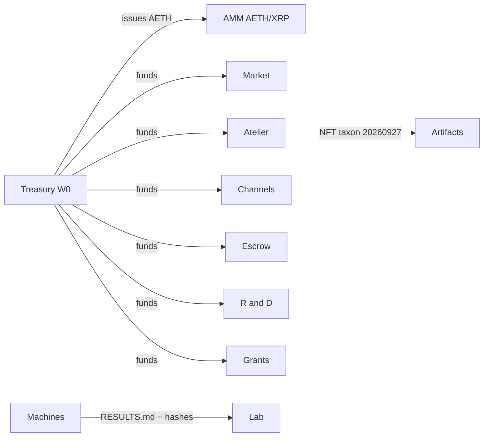

# Architecture

Aether Foundry is a testnet lab corporation. The GitHub repo is the corporate archive; the ledger is the economy.

```mermaid
flowchart LR
  W0[Treasury W0] -->|issues AETH| AMM[AMM AETH/XRP]
  W0 -->|funds| W1[Market]
  W0 -->|funds| W2[Atelier]
  W0 -->|funds| W3[Channels]
  W0 -->|funds| W4[Escrow]
  W0 -->|funds| W5[R and D]
  W0 -->|funds| W6[Grants]
  W2 -->|NFT taxon 20260927| Artifacts
  Machines -->|RESULTS.md + hashes| Lab
```

See `MASTER_PROMPT.md` for hard laws and the operating loop.
