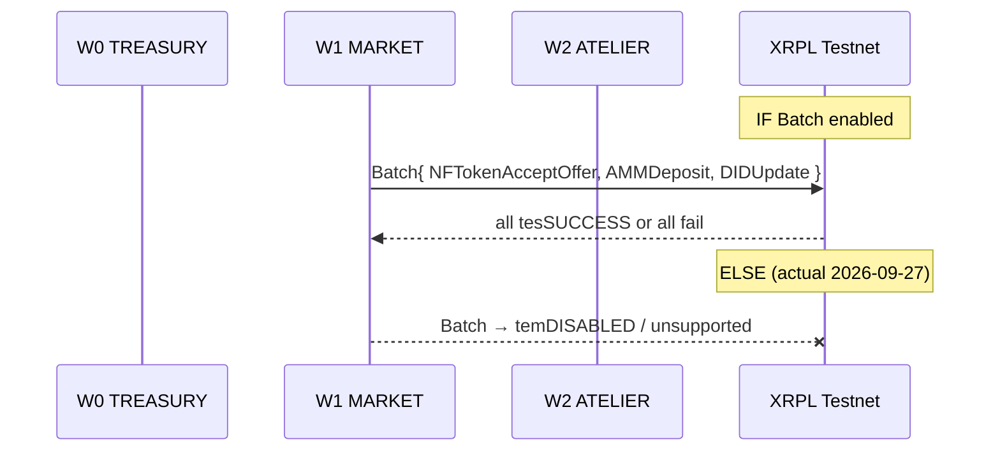

# Machine — Batch Heartbeat (Foundry Night C)

**Status:** spec only — Testnet Batch still disabled (Day 7 re-probe 2026-09-28 20:17 CDT, network id 1). Devnet id 2 reports Batch enabled; this pack still does not submit it.  
**Network:** XRPL Testnet only (`wss://s.altnet.rippletest.net:51233`)  
**Thesis:** One atomic **Batch** corporate heartbeat: accept an NFT buy offer + AMMDeposit + DIDUpdate in a single transaction so inventory, liquidity, and public identity move together or not at all.

## Blocking question (answered first)

> **Is Batch enabled on this server?**

**No.** Latest live `feature` probe 2026-09-27 ~11:52 AM CT via HTTPS JSON-RPC (rippled **3.4.1**, ledger 21096312); same gate as morning session-5:

| Amendment name | Hash (abbrev) | enabled | supported |
|----------------|---------------|---------|-----------|
| BatchV1_1 | 9F287AED… | **false** | true |
| fixBatchV1_2 | 14A2B45E… | **false** | true |
| TicketBatch | 955DF3FA… | true | true |

`TicketBatch` ≠ atomic multi-tx **Batch**. Atomic Batch is **disabled**. Per Director: **no Batch probe tx**; document feature gate in RESULTS.

## Primitive composition (≥3)

1. **NFTokenAcceptOffer** — accept inbound buy offer on a Foundry artifact (or sell-side counterpart).
2. **AMMDeposit** — add XRP and/or AETH to `r4nTCaJ83W7HX3dHMrLrWTWCkFBeRSrS4w`.
3. **DIDUpdate** (or DIDSet) — bump W0 DID document URI / data to heartbeat timestamp in charter.
4. **Batch** wrapper — atomicity (amendment-gated).

## Success metrics (when amendment flips)

| Metric | Target |
|--------|--------|
| Single Batch hash containing all three inners | yes |
| Partial apply impossible | yes (protocol) |
| Seeds in repo | none |

## Non-goals

- No sequential faux-heartbeat pretending to be Batch.  
- No probe tx while `enabled:false`.  
- No Machine #4 product trial disguise.
