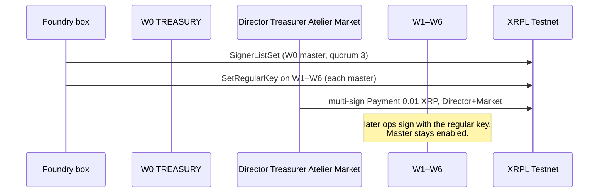

# Governance board — SignerList on W0, regular keys on W1–W6

**Status:** policy in force (hunch H1). Ledger set is Foundry-box gated until `RESULTS.md` records a `SignerListSet` hash.  
**Network:** XRPL Testnet only (`wss://testnet.xrpl-labs.com`, network id 1). Not Xahau. Not mainnet.  
**Account:** W0 TREASURY `rJ9WRLiHuB6STbRCUqRKVsqKDbrGAbEbVs`

Week 1 said the Director signs from W0 and that W1–W6 would grow regular keys. This cut is that board.



## Hunch H1

| Persona | Weight |
|---------|-------:|
| Director | 2 |
| Treasurer | 2 |
| Atelier | 1 |
| Market | 1 |
| **Quorum** | **3** |

Sum is 6. No single key reaches 3. Atelier + Market = 2 and does not pass. Every other pair passes. The demo coalition is Director + Market, weight exactly 3.

These four seeds are generated by the operator and held by the founder. That simulates a board. It is not independent custody. The control a script can actually enforce is that one signer seed is not enough.

## What gets signed

| Tx | Who signs the setup | What it does |
|----|---------------------|----------------|
| `SignerListSet` | W0 master | Installs the list. Quorum 3. |
| `SetRegularKey` | Each of W1–W6 master | Sets `AccountRoot.RegularKey`. |
| `Payment` (optional) | Director + Market multi-sign | 10000 drops from W0 to W6. |

`AccountSet` is not used. `RegularKey` is not an AccountSet field. `asfDisableMaster` is refused. Master keys on W0–W6 stay enabled.

Signer and regular-key addresses are unfunded key pairs (ed25519). They are not W0–W6. Public addresses are written to `activated.json` by the live run. Seeds stay in `AETHER_SECRETS` or `/workspace/aether-foundry-secrets/.env`.

## One-click

```bash
npm run gov:dry
npm run gov:live
npm run gov:multisign
```

`gov:dry` reads the ledger and does not load seeds. `gov:live` sets the list and the regular keys. `gov:multisign` does that and then the 0.01 XRP quorum payment. Re-running the multisign command sends another 0.01 XRP.

Outgoing W0 payments ≥ 50 test XRP still need `/lab/motions/`. The demo is under that line.
