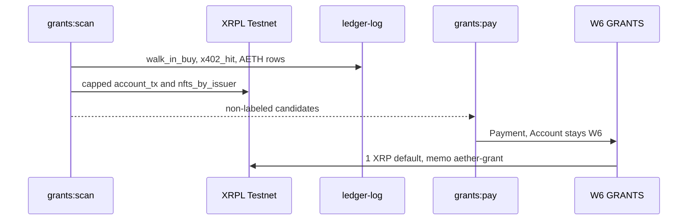

# Grants flywheel — W6 pays users of Foundry artifacts

**Network:** XRPL Testnet only (`https://testnet.xrpl-labs.com`, network id 1). Not mainnet. Not Xahau.  
**Payer:** W6 GRANTS `rfnqxYQWKsVGFuWLjky41puXHJkT2v8yTf`  
**Experiment:** `grants-flywheel`  
**Purpose memo:** `aether-grant`

W6 sends a small Testnet XRP Payment to a counterparty who already used a Foundry artifact. The payment is a flywheel: Walk-In buyers, x402 payers to W3, AETH trust-line or path-pay users, and holders of taxon `20260927` NFTs. It is not a spray of faucet dust, and it is not a grid bot.



## Exclusion rule

Every address in `web/lib/xrpl-public.ts` `WALLETS` is ineligible. That list is W0–W6, the AMM, BUYER, and STRANGER.

STRANGER (`rh4c6qMMyafccZrPFCPCN742BNMXfjKYss`) is a Foundry test actor. A walk-in from that address does not earn a grant. The Day-30 faucet buyer `rQsPPdwiBeVDqsdDnFcVmu7xTVHMjXRFqN` is not in `WALLETS`. A Walk-In accept from that address is eligible.

Already-paid pairs of destination and reason stay ineligible for 7 days. The cooldown log is `lab/grants/ledger.jsonl`. The newest 20 W6 Payments are also read, and a memo of `purpose=aether-grant`, `experiment=grants-flywheel`, and `reason=<reason>` counts as paid.

## Default grant

| Field | Value |
|-------|--------|
| Amount | 1 XRP (`1000000` drops) |
| SourceTag | `202609276` |
| Motion line | ≥ 50 XRP (`50000000` drops) needs `lab/motions/` |
| Float | W6 must keep 10 XRP spendable after the payment |
| Optional AETH | `--aeth`, 1 AETH, SendMax capped at 2 XRP, only when the chosen reason is `aeth_counterparty` |

`--drops` may raise or lower the XRP amount. At or above 50 XRP the command refuses unless a motion file names that destination and that amount. W0 is not debited. The desk does not sign.

## Signer

`npm run grants:pay` prefers `W6_REGULAR_SEED`. If that is absent it uses `W6_SEED`, then `GRANTS_SEED`. The Payment `Account` is always W6. The regular key's classic address must match `machines/governance-board/activated.json` and the on-ledger `RegularKey`. Seeds stay in `AETHER_SECRETS` or `/workspace/aether-foundry-secrets/.env`.

## Commands

```bash
npm run grants:scan
npm run grants:pay -- --dry-run
npm run grants:pay -- --drops 1000000 --record
```

`--dry-run` prints candidates and the unsigned Payment. It does not read a seed. Live signing refuses `CI` / `GITHUB_ACTIONS`, mainnet hosts, and NetworkID 0. `--record` appends `lab/ledger-log.jsonl`, sets `grants_paid` in `market/pnl.md`, and appends `RESULTS.md` only after `tesSUCCESS`. The cooldown file is written on that same success. A failed transaction is not archived and is not a hash.
