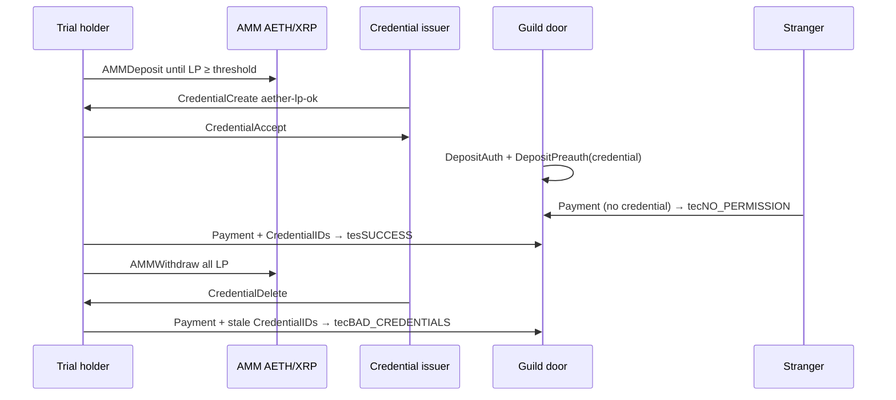

# Machine — LP Badge Bound (v1)

**Status:** trialled — ledger-enforced credential door on XRPL Testnet (see RESULTS.md)  
**Network:** XRPL Testnet only (`wss://testnet.xrpl-labs.com`, network id `1`)  
**Thesis:** A guild door that accepts a payment only when the sender presents an accepted `aether-lp-ok` credential. The issuer creates that credential while the sender's Foundry AMM LP is at least the threshold, and deletes it after the LP is withdrawn. The door's reject does not consult an off-chain verifier.

## Why this primitive

Live `feature` on rippled 3.4.1 (2026-09-27):

| Amendment | Enabled |
|-----------|---------|
| `Credentials` `1CB67D082CF7D9102412D34258CEDB400E659352D3B207348889297A6D90F5EF` | **yes** |
| `DepositPreauth` / `DepositAuth` | **yes** |
| Any amendment whose name contains `Hook` | **none in the map** |

Hooks are not installed on this XRPL Testnet. The script refuses to submit if Credentials are off, and refuses to proceed if an enabled Hooks-named amendment appears (that would be a different server). Xahau remains the home of the W7 split hook. These door accounts are not Xahau accounts and are not W1/W2.

## Primitive composition (≥3)

1. **AMM LP token** — existing pool `r4nTCaJ83W7HX3dHMrLrWTWCkFBeRSrS4w`, currency `0330E60FAE706EAD2C7D511D790B07A6F3B89931`.
2. **CredentialCreate / CredentialAccept / CredentialDelete** — issuer attests `aether-lp-ok` only while LP ≥ 1000, and deletes it once LP is below that.
3. **DepositAuth + DepositPreauth `AuthorizeCredentials`** — the door rejects payments that do not present that accepted credential.
4. **Payment `CredentialIDs`** — the use of the privilege. PASS and FAIL are transactions, not a local `if`.

## Twin relationship

| Role | This machine | Existing anchor |
|------|----------------|-----------------|
| LP pool | same AMM | `r4nTCaJ83W7HX3dHMrLrWTWCkFBeRSrS4w` |
| v0 badge NFT | not moved | W1 `rsi9kh9Pdkrn16sABjg8yGqZLVuT1qphzS`, NFTokenID `000803E8…DD5C` |
| Credential issuer | faucet account in `addresses.json` | not W2 |
| LP holder | faucet account in `addresses.json` | not W1 |

W1 still holds the seeded ~500000 LP. This trial deposits and withdraws a small position from a new holder so the seeded pool is not emptied. The v0 NFT stays an unbound souvenir. The privilege that fails is the door payment.

## Scripts

| Command | Signs? |
|---------|--------|
| `npm run lp-badge:bound -- --dry-run` | no |
| `npm run lp-badge:bound -- --record` | yes, Foundry box only |

Seeds: `LPB_ISSUER_SEED`, `LPB_HOLDER_SEED`, `LPB_DOOR_SEED`, `LPB_STRANGER_SEED` in `AETHER_SECRETS` or `/workspace/aether-foundry-secrets/.env`.
