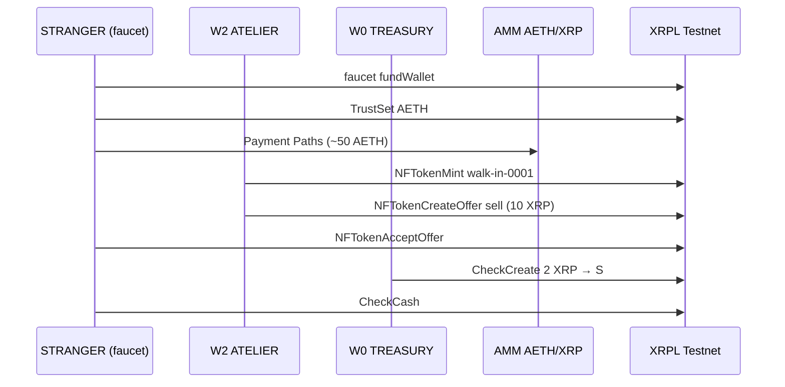

# Machine #3 — Walk-In Window

**Status:** v0 live on XRPL Testnet (2026-09-27 session-4)  
**Network:** XRPL Testnet only (`wss://s.altnet.rippletest.net:51233`)  
**Thesis:** An open storefront NFT that a **new faucet stranger** (not a returning BUYER) can buy with plain XRP — Walk-In Window, not invitation-only.

## Primitive composition (≥3)

1. **NFTokenMint / NFTokenCreateOffer / NFTokenAcceptOffer** — transferable walk-in artifact (taxon `20260927`, 1% royalty).
2. **Payment (Paths / SendMax)** — STRANGER converts XRP → ~50 AETH through AMM `r4nTCaJ83W7HX3dHMrLrWTWCkFBeRSrS4w`.
3. **CheckCreate / CheckCash** — W0 tips STRANGER 2 XRP after purchase (optional hospitality).
4. *(Housekeeping)* **PaymentChannelCreate / Claim tfClose** — SettleDelay≥300 threat drill (documented in drip-pass THREAT, not part of Walk-In product).

## Success metrics (session-4)

| Metric | Result |
|--------|--------|
| New STRANGER faucet wallet | `rh4c6qMMyafccZrPFCPCN742BNMXfjKYss` |
| Path-pay delivered | 50 AETH |
| walk-in-0001 sold to STRANGER (not BUYER) | yes |
| xrp-ledger.toml published | yes |
| Seeds in repo | none |

## Non-goals

- Hooks, EVM, x402 server, new CLOB, TokenEscrow v0.2, Drip Pass v2.
- Using BUYER as the walk-in purchaser (BUYER accepting does **not** count).

See `RESULTS.md` for hashes. Operator steps in `RUNBOOK.md`.
