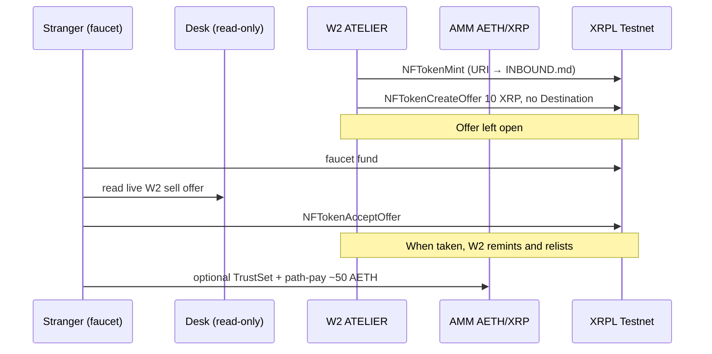

# Machine #3 — Walk-In Window

**Status:** v2 standing storefront on XRPL Testnet (2026-09-27). Sell offer left open. A dry-run watcher notices when it is taken; the founder remints locally.  
**Network:** XRPL Testnet only (`wss://testnet.xrpl-labs.com` / HTTPS `https://testnet.xrpl-labs.com`)  
**Thesis:** An open storefront NFT that a **new faucet stranger** (not a returning BUYER) can buy with plain XRP — Walk-In Window, not invitation-only.

Strangers start with `npm run buy:walk-in` ([`INBOUND.md`](./INBOUND.md) step 1). The v2 token URI is that file. The public desk reads W2 sell offers at request time and does not sign. `GET /api/inbound/walk-in` returns the live offer and the same command.

## Primitive composition (≥3)

1. **NFTokenMint / NFTokenCreateOffer / NFTokenAcceptOffer** — transferable storefront artifact (taxon `20260927`, TransferFee `1000`). W2 lists it; the stranger submits the accept. Sell flag `tfSellNFToken`, no Destination.
2. **Payment (Paths / SendMax)** — optional after purchase: the buyer converts XRP → ~50 AETH through AMM `r4nTCaJ83W7HX3dHMrLrWTWCkFBeRSrS4w`.
3. **CheckCreate / CheckCash** — v0 hospitality only (W0 tipped the session-4 STRANGER 2 XRP). Not part of the standing listing.

## v2 listing (standing)

| Field | Value |
|-------|-------|
| Seller | W2 `rLBKyi1NKoXmMXUHPH4ZFZLUKyXfUywKEw` |
| NFTokenID | `000803E8D25E64BC6D436EA502CE71902FE64120C571FCF1C81EFBC70141DD5D` |
| OfferID | `08F7769F074C8C80C4DD6A691D2CEE3A3996458D845DA3C15F62BBAF699421B0` |
| Mint hash | `DC7609E1331198731F7C0B2E58378C39F4F11511F40337DB3A4C865F00368E10` |
| CreateOffer hash | `2C013A0988DA6610B088D72B8E6F0378CFF52E9D7CB2ED2B181D3546318DDDBC` |
| Price | 10 XRP (`10000000` drops) |
| URI | `INBOUND.md` on `main` |

These IDs match the listing that was left open. After a purchase they are consumed. The desk shows whatever sell offer W2 has now.

`npm run watch:walk-in` polls that ledger read and exits 0 while OPEN. When no sell offer remains it writes a dry-run plan under `lab/remint-plans/`, one `walk_in_sold_out` line in `lab/ledger-log.jsonl`, and a detection line in `RESULTS.md`. It does not sign. The scheduled workflow `.github/workflows/walk-in-remint-watch.yml` runs that detect path only.

The founder then runs `npm run remint:walk-in` (`node src/walk-in-storefront-v2.js`) on a box with `W2_SEED` in `AETHER_SECRETS` or `/workspace/aether-foundry-secrets/.env` (never in git, never in GitHub Actions). That mints and relists 10 XRP with no Destination, then the desk shows OPEN again. Do not accept the new offer.

## v0 (session-4, closed)

walk-in-0001 was sold to STRANGER `rh4c6qMMyafccZrPFCPCN742BNMXfjKYss` for 10 XRP. That sale is history. It is not the standing offer.

## Success metrics

| Metric | Result |
|--------|--------|
| v2 sell offer left open on W2 | yes — see desk / `RESULTS.md` |
| New STRANGER faucet wallet (v0) | `rh4c6qMMyafccZrPFCPCN742BNMXfjKYss` |
| Path-pay delivered (v0) | 50 AETH |
| walk-in-0001 sold to STRANGER (not BUYER) | yes |
| xrp-ledger.toml + INBOUND weblink | yes |
| Seeds in repo | none |

## Non-goals

- Hooks, EVM, x402 server, new CLOB, TokenEscrow v0.2, Drip Pass v2.
- Using BUYER as the walk-in purchaser (BUYER accepting does **not** count).
- A signing UI on the desk.

See `RESULTS.md` for hashes, `RUNBOOK.md` for the remint loop, and `INBOUND.md` for buyers.
