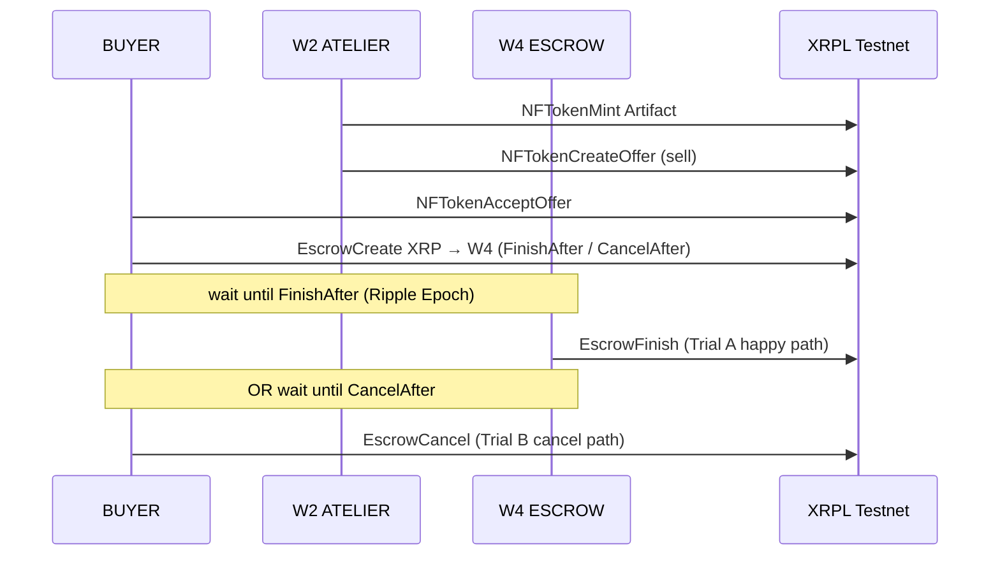

# Machine #1 — Work-Ticket Escrow

**Status:** v0 live on XRPL Testnet (2026-09-27 session-2)  
**Network:** XRPL Testnet only (`wss://testnet.xrpl-labs.com`)  
**Thesis:** Escrow XRP work payment to W4 against an Atelier Artifact NFT deliverable; release on time-lock finish or return on cancel.

## Primitive composition (≥3)

1. **EscrowCreate / EscrowFinish / EscrowCancel** — time-locked XRP deposit to W4 (v0: time locks only, no crypto-condition).
2. **NFTokenMint / NFTokenCreateOffer / NFTokenAcceptOffer** — Artifact receipt + sell → BUYER acquisition.
3. **Payment** — implicit via escrow finish credit; NFT sale Amount is a Payment-equivalent transfer.

## v0 settlement rule

- Currency: **XRP only** (AETH TokenEscrow = v0.1 spec — see `ECONOMICS.md` / `TOKENS.md`).
- Locks: **FinishAfter + CancelAfter** (Ripple Epoch seconds = Unix − 946684800).
- Destination: **W4 ESCROW** `ra9X6T4Fk9qfD8ncKczHaG5GdkYcLcD5pN`.
- Artifact: minted by W2, taxon `20260927`, TransferFee `1000` (1% to issuer W2 on secondary sales).

## Success metrics (session-2)

| Metric | Result |
|--------|--------|
| Trial A EscrowFinish | `tesSUCCESS` |
| Trial B EscrowCancel | `tesSUCCESS` |
| Artifact #1 minted + sold to BUYER | yes |
| Seeds in repo | none |

## Non-goals (v0)

- Mainnet, conditioned escrow, TokenEscrow, Hooks, EVM, TOML.
- CLOB grid beyond the four passive housekeeping offers.

See `RESULTS.md` for hashes. Run via `RUNBOOK.md`.
