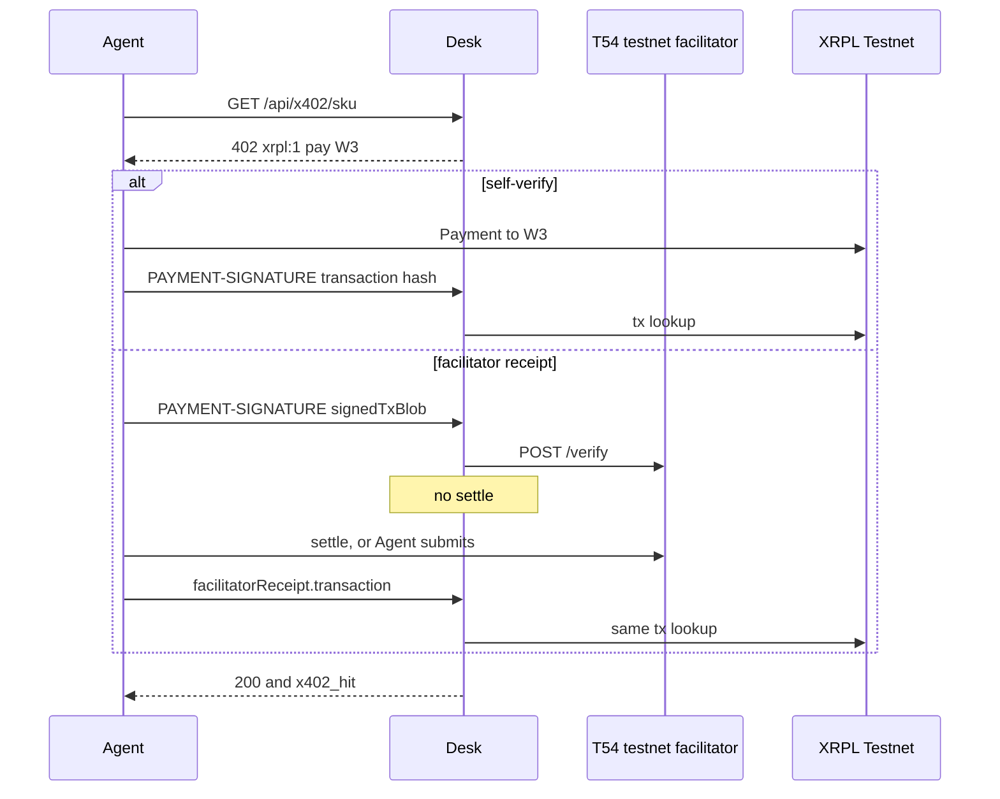

# F11 — Public x402 citizen

**Network:** XRPL Testnet only. CAIP-2 `xrpl:1`. Network id **1**. Mainnet `xrpl:0` is refused.  
**Pay-to:** W3 CHANNELS `rB6tyDtACcaihvoHKocuA5snG8H7Hn43Fw`  
**Facilitator:** `https://xrpl-facilitator-testnet.t54.ai` when `XRPL_FACILITATOR_URL` is that origin. Otherwise the desk stays on self-verify.  
**Desk:** read-only. It may `POST /verify`. It does not call settle and it does not sign.

Foundry was a private 402 island: the buyer submitted a Payment, and the desk read it. Foreign agents that only speak T54 hand the desk a signed blob and expect a facilitator. This pack keeps the ledger read and adds a second door for those receipts.

## Modes

| `XRPL_FACILITATOR_URL` | `/api/status` `facilitator.mode` | What the desk does |
|---|---|---|
| unset | `self-verify` | Ledger read only. A receipt that already names the testnet host still falls through to that read. |
| `https://xrpl-facilitator-testnet.t54.ai` | `dual` | Same ledger read, plus `POST /verify` when a signed blob is not on a ledger yet. |
| any other host, including `xrpl-facilitator-mainnet.t54.ai` | `refused` | The request fails before a ledger read. `XRPL_NETWORK=xrpl:0` fails the same way. |

`facilitator.settles` is always `false`. `facilitator.networkId` is `1`.

The catalog at `GET /api/x402` and `howToPay.facilitator` advertise the testnet origin even while mode is `self-verify`, so an agent looking at the desk can see where T54 traffic belongs. Wiring that origin into the env is what turns verify on.

## Outbound

`npm run x402:citizen` is the daily buy from W3. Dry-run is the default. `--live` needs `FOUNDRY_DAEMON_LIVE=yes` on the Foundry box. The cap is `500000` drops (0.5 XRP), the same Hands outbound cap.

The Payment carries the shop's `SourceTag` when the 402 names one, otherwise SourceTag `202609296`. It always adds a memo whose type is `aether-foundry` and whose data is `aether-foundry:f11`. The retry header carries `payload.invoiceId` from the challenge. Foundry does not submit that blob when the shop settles it.

`machines/x402-citizen/candidates.json` ships with an empty `urls` list. No foreign shop was known at pack time, so a run with no `--url` dry-runs and does not invent a hash. Pass `--url` when a Testnet SKU outside `WALLETS` answers 402.

## Non-goals

- No Batch, Vault, ConfidentialTransfer, or Sponsor transaction.
- No mainnet facilitator and no mainnet RPC.
- The desk does not submit the buyer's blob.
